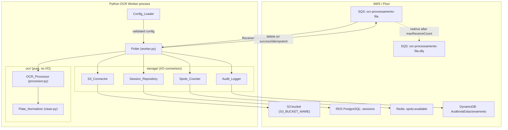

# Design Document: Python OCR Worker

## Overview

The Python OCR Worker is the asynchronous processing stage of the AWS parking-lot system. It long-polls the Amazon SQS queue `ocr-processamento-fila`, downloads the vehicle photo from S3, extracts the license plate via image pre-processing plus Tesseract OCR, normalizes it, and then advances the parking session by applying an ordered set of side effects: update RDS, decrement the Redis spots counter, write a DynamoDB audit entry, and finally delete the SQS message.

The Worker is a peer of the Go API (`api/`). The API is the *producer* (it creates the `PROCESSING` session, uploads the photo, and publishes the SQS message); the Worker is the *consumer* that transitions the session from `PROCESSING` to `PARKED`. Both processes share the same data stores, so the Worker MUST honor the exact contracts the API already established, never inventing new table names, key names, status strings, or item shapes.

Two goals dominate the design:

1. **Exactly-once effect under at-least-once delivery.** SQS guarantees at-least-once delivery, so the same message can arrive more than once. The Worker relies on the RDS session `status` as the single source of truth for idempotency: the spots counter is decremented once per session because the `PROCESSING -> PARKED` transition happens once. A redelivered message whose session is already `PARKED`/`PAID` is deleted without re-applying side effects.
2. **Dual-mode operation.** The identical code runs against Floci (`AWS_ENDPOINT_URL=http://localhost:4566`) locally and against real AWS Academy when `AWS_ENDPOINT_URL` is absent, driven entirely by environment variables.

### Key Design Decisions

- **Language/runtime:** Python 3.14 managed by `uv`, per `worker/AGENTS.md`. Dependencies: `boto3` (S3/SQS/DynamoDB), `pytesseract` + `Pillow` (OCR and imaging), `psycopg` (PostgreSQL), `redis` (ElastiCache). Lint/format via `ruff`, tests via `uv run pytest`.
- **Idempotency anchor is RDS, not a separate ledger.** Introducing a dedup table would add a data store the API does not know about. Instead, the session `status` column already models the lifecycle (`PROCESSING -> PARKED -> PAID`), and a conditional `UPDATE ... WHERE id = :id AND status = 'PROCESSING'` gives us a single atomic gate for "first successful processing."
- **DLQ via SQS redrive, not application code.** The Worker does not implement its own dead-letter storage. It relies on the SQS redrive policy to move poison messages after `maxReceiveCount`. This is an **infra dependency** (see Assumptions) because `infra/main.tf` does not yet define a DLQ or redrive policy.
- **Poison detection via `ApproximateReceiveCount`.** The Worker reads the SQS system attribute `ApproximateReceiveCount` per message to make redelivery/poison decisions without maintaining its own counter.

### Assumptions and Infra Dependencies

- **DLQ + redrive policy (implemented in `infra/main.tf`).** `ocr-processamento-fila` has `visibility_timeout_seconds = 300` and a `redrive_policy` to `ocr-processamento-fila-dlq` with `maxReceiveCount = 3`. The Worker constant `MAX_RECEIVE_COUNT` MUST stay equal to that `maxReceiveCount`.
- **`maxReceiveCount` value (resolved 2026-09-29).** The requirements previously mixed "5 delivery attempts" (Req 9.3/10.4/13.5) with "maximum receive count of 3" (Req 12.2/12.3). All of them now use **3**, the SQS redrive `maxReceiveCount`. Because SQS moves the message to the DLQ right after its 3rd receive, the Worker classifies a message as poison when it *fails on* the 3rd delivery (`receive_count >= 3`) and audits it then; a message seen beyond 3 (redrive missing or lagging) is neither reprocessed nor re-audited.
- **Visibility timeout (resolved 2026-09-29).** Req 9.4 and Req 13.2 now both use **300 s**, configured on the queue in `infra/main.tf`.
- **Redis is single-node** (`cache.t3.micro`), so `DECR` is atomic on the server and no distributed lock is needed.

## Architecture

The Worker is a single long-running process with a clear separation between the polling/orchestration layer (`worker.py`), the pure OCR/normalization layer (`ocr/`), and the I/O connector layer (`storage/`). The pure layer has no AWS or DB dependencies, which makes it directly unit- and property-testable.



### Processing Pipeline

The Poller drives each message through a fixed sequence. The **status check** happens before any side effect so that redelivered/terminal messages are short-circuited (idempotency), and the **ordered side effects** (RDS -> Redis -> DynamoDB -> SQS delete) guarantee the counter is only touched after the durable status transition.

```mermaid
sequenceDiagram
    participant Q as SQS
    participant P as Poller
    participant S3 as S3_Connector
    participant O as OCR_Processor
    participant N as Plate_Normalizer
    participant R as Session_Repository (RDS)
    participant C as Spots_Counter (Redis)
    participant A as Audit_Logger (DynamoDB)

    Q->>P: ReceiveMessage (<=10, WaitTime=20s)
    P->>P: parse + validate Session_Message
    alt malformed / invalid payload
        P->>A: record poison reason (best-effort)
        Note over P,Q: leave message -> SQS redrive handles removal
    else valid payload
        P->>R: read session by session_id
        alt status = PARKED or PAID (idempotent)
            P->>Q: DeleteMessage
        else session not found
            P->>Q: DeleteMessage
        else lookup failed (connection error)
            Note over P,Q: do NOT delete; leave for redelivery
        else status = PROCESSING
            P->>S3: download(s3_key)
            S3-->>P: image bytes (<=10MB)
            P->>O: preprocess + OCR
            O-->>P: raw text
            P->>N: normalize(raw text)
            alt unreadable plate
                Note over P,Q: leave PROCESSING; do NOT delete; log unreadable
            else readable plate
                P->>R: UPDATE ... SET plate, status='PARKED' WHERE status='PROCESSING'
                R-->>P: rows affected = 1 (transaction still open)
                P->>C: DECR spots:available
                P->>A: PutItem action=OCR_PROCESSING
                P->>R: COMMIT (on any failure: ROLLBACK + INCR if DECR ran)
                P->>Q: DeleteMessage
            end
        end
    end
```

**Why one transaction.** The RDS conditional `UPDATE` is the idempotency gate, and its transaction stays open while Redis `DECR` and the DynamoDB `PutItem` run; it commits only after both succeed. If either fails, the transaction rolls back (row stays `PROCESSING`) and a `DECR` that already ran is compensated with `INCR`, so the redelivery re-runs the whole pipeline from a clean state. Committing RDS first (the original design) was wrong: a Redis/DynamoDB failure left the row `PARKED`, the redelivery short-circuited on `PARKED` (Req 11.1) and the decrement/audit were lost for good. The `UPDATE` also holds the row lock until COMMIT, so concurrent deliveries on other ASG instances serialize and update zero rows. The only irreversible effect is an audit entry written right before a failed COMMIT (an extra entry, never a missing one). SQS delete is last so any earlier failure leaves the message for redelivery (Req 9.2).

### Concurrency and Signals

- The Poller runs a single-threaded loop; messages in a batch are processed sequentially. This keeps the idempotency reasoning simple and is sufficient for the coursework scale.
- Graceful shutdown (Req 16) is implemented with signal handlers for `SIGTERM`/`SIGINT` that set a `stop` flag. The loop stops requesting new messages, finishes the in-flight message (bounded by a 30 s shutdown timer), then closes connections.

## Components and Interfaces

All connectors are defined as narrow, mockable classes. The pure OCR layer exposes plain functions returning result objects (never raising for domain outcomes like "unreadable"), so failures are explicit and testable.

### Config_Loader (`config.py`)

Loads and validates env vars at startup; fails fast before the loop starts.

```python
@dataclass(frozen=True)
class Config:
    aws_endpoint_url: str | None   # None => default AWS endpoints
    aws_region: str
    aws_access_key_id: str
    aws_secret_access_key: str
    sqs_queue_url: str
    database_url: str
    redis_url: str
    s3_bucket_name: str
    dynamodb_table_name: str

def load_config(env: Mapping[str, str]) -> Config:
    """Reads env (Req 14.1). Raises ConfigError listing every missing/empty
    required var (Req 14.2, 15.4) and every malformed URL/connection string
    (Req 14.4, 15.3). AWS_ENDPOINT_URL is optional (Req 14.3, 15.2)."""

def redact(value: str) -> str:
    """Returns a fixed marker for secrets in logs (Req 14.5)."""
```

- Required (must be non-empty): `AWS_REGION`, `SQS_QUEUE_URL`, `DATABASE_URL`, `REDIS_URL`, `S3_BUCKET_NAME`, `DYNAMODB_TABLE_NAME`.
- Optional: `AWS_ACCESS_KEY_ID` + `AWS_SECRET_ACCESS_KEY` (as a pair; absent => boto3 default credential chain, e.g. the EC2 instance profile `LabRole`) and `AWS_SESSION_TOKEN` (temporary AWS Academy credentials).
- Optional: `AWS_ENDPOINT_URL` (absent/empty => default endpoints).
- URL/scheme validation for `SQS_QUEUE_URL`, `DATABASE_URL`, `REDIS_URL`, `AWS_ENDPOINT_URL` (must be `http`/`https` when present).
- Any log line involving credentials substitutes a redaction marker for `AWS_ACCESS_KEY_ID`, `AWS_SECRET_ACCESS_KEY`, `AWS_SESSION_TOKEN`, and credentials embedded in `DATABASE_URL`/`REDIS_URL`.

### AWS client factory (`storage/clients.py`)

Single place that applies endpoint resolution identically to all AWS clients (Req 15.1, 15.5).

```python
def build_boto3_session(cfg: Config) -> boto3.Session: ...
def s3_client(cfg): ...        # endpoint_url=cfg.aws_endpoint_url or None
def sqs_client(cfg): ...
def dynamodb_client(cfg): ...
```

### Poller (`worker.py`)

Owns the loop, orchestration, idempotency branch, ordered side effects, deletion, poison classification, and shutdown.

```python
class Poller:
    def __init__(self, cfg, sqs, s3, sessions, spots, audit, ocr, normalizer): ...
    def run(self) -> int: ...                 # returns exit code (Req 16.4)
    def _receive(self) -> list[Message]: ...   # WaitTime=20s, Max=10 (Req 1.1)
    def _handle(self, msg: Message) -> None: ...# one message end-to-end
    def _receive_count(self, msg) -> int: ...   # ApproximateReceiveCount (Req 12.2)
    def request_stop(self, signum, frame): ...  # SIGTERM/SIGINT (Req 16.1)
```

Processing outcomes drive whether the message is deleted:

```python
class Outcome(enum.Enum):
    DELETE = "delete"      # success or terminal/idempotent -> DeleteMessage
    RETAIN = "retain"      # transient failure / unreadable -> leave for redelivery
    POISON = "poison"      # exceeded receive count / malformed -> rely on SQS redrive
```

### Plate localization (`ocr/locate.py`) — pure

```python
def find_mercosul_plates(image: Image.Image) -> list[Image.Image]:
    """Crops of the character strip below each Mercosul blue band (OpenCV HSV
    mask + shape filters), largest first, at most 3."""
```

Tesseract cannot read a plate that is a small part of a car photo, and a global threshold rarely separates it from the car body. The Mercosul blue band is found by color; the characters are the strip below it, whose height is a fixed fraction of the band width (plate 400 x 130 mm).

### OCR_Processor (`ocr/processor.py`) — pure

```python
@dataclass
class OcrResult:
    ok: bool
    raw_text: str | None
    error: str | None       # "decode" | "no_text" | "timeout"
    mercosul: bool = False  # a Mercosul plate was located by its band

def extract_text(image_bytes: bytes, timeout_s: float = 10.0) -> OcrResult:
    """For each located strip, then the whole photo:
    rescale -> grayscale -> Otsu threshold -> Tesseract (Req 4.1-4.6),
    all within one shared timeout budget."""
```

- Located strip: trimmed of the "BR"/QR zone, rescaled to 100 px high, white margin, `--psm 8/13/7`.
- Whole photo: longer side rescaled into 1000–2000 px, `--psm 7/6/11`.
- Every Tesseract call uses a `A-Z0-9` whitelist and the remaining budget as its `timeout` (pytesseract kills the subprocess).
- Outputs are joined one per line, strips first.

### Plate_Normalizer (`ocr/clean.py`) — pure

```python
@dataclass(frozen=True)
class PlateResult:
    ok: bool
    plate: str | None       # canonical plate when ok
    reason: str | None      # "empty" | "no_match" when not ok

MERCOSUL = re.compile(r"^[A-Z]{3}[0-9][A-Z][0-9]{2}$")   # ABC1D23
OLD       = re.compile(r"^[A-Z]{3}[0-9]{4}$")            # ABC1234 (canonical, no hyphen)

def normalize(raw: str, *, mercosul: bool = False) -> PlateResult:
    """Search every 7-char window (each line, then the whole text) for an exact
    plate; otherwise fit windows to the LLLDLDD / LLLDDDD templates with
    positional swaps (O->0, 1->I, S->5, ...). Idempotent on valid plates
    (Req 5.1-5.7)."""
```

- Exact matches win over corrected ones.
- Corrections: at most 2 swaps, fewest swaps wins; Mercosul only when the text contains `BRASIL`/`MERCOSUL`.
- `mercosul=True` (plate located by its band): Mercosul only, up to 3 swaps. This is what reads the Mercosul typeface, whose `5`, `I` and slashed `0` Tesseract reads as `S`, `1` and `O`.
- Known limit: letter/letter confusions (`I` vs `L`) cannot be corrected by position.

Note on Old_Format: the requirement describes the *pattern* `ABC-1234`. Since normalization strips non-alphanumeric characters, the hyphen is removed and the canonical stored value is `ABC1234` (7 alphanumeric chars). The `sessions.license_plate` column is `VARCHAR(16)`, so both formats fit within the 1–16 constraint (Req 6.4).

### S3_Connector (`storage/s3_store.py`)

```python
class S3Connector:
    def download(self, key: str) -> bytes:
        """Download within 10s, cap at 10MB, 3 retries on transient errors.
        Raises RetrievalError('not_found'|'too_large'|'invalid_params'|'unavailable')
        (Req 3.1-3.7). Content held in BytesIO and released by caller."""
```

Size cap is enforced by checking `ContentLength` and by bounding the read; on overflow the buffer is discarded (Req 3.4).

### Session_Repository (`storage/session_repo.py`)

Uses `psycopg` against `DATABASE_URL`. Matches the exact `sessions` schema.

```python
@dataclass
class SessionRow:
    id: str
    license_plate: str | None
    status: str            # PROCESSING | PARKED | PAID
    s3_photo_key: str

class SessionRepository:
    def get(self, session_id: str) -> SessionRow | None:  # Req 6.3, 11.x lookups
        ...
    @contextmanager
    def parking_transition(self, session_id: str, plate: str) -> Iterator[bool]:
        """Conditional update inside an open transaction — the idempotency gate.
        UPDATE sessions SET license_plate=%s, status='PARKED'
        WHERE id=%s AND status='PROCESSING';
        yields True iff exactly one row was updated; commits when the with-body
        succeeds, rolls back when it raises (Req 6.1, 6.5, 6.6, 11.5, 13.3)."""
```

The conditional `WHERE status='PROCESSING'` means a redelivered message that already advanced the row updates zero rows, so `parking_transition` yields `False` and the Poller skips the Redis decrement — this is the mechanism behind "exactly-once DECR per session."

### Spots_Counter (`storage/spots.py`)

```python
class SpotsCounter:
    def decrement(self) -> int:
        """Atomic DECR spots:available within 500ms, clamp at >=0,
        retry up to 3x on connection error (Req 7.1, 7.5, 7.6)."""
    def increment(self) -> int:
        """INCR spots:available — compensates a DECR whose RDS transaction
        rolled back (Req 13.3)."""
```

Absent key: `DECR`/`INCR` run as Lua scripts that do nothing when `spots:available` does not exist (Req 7.7), so after a Redis restart the API rebuilds the count from RDS. Underflow handling: after `DECR`, if the returned value is `< 0`, the counter is reset to `0` (`SET spots:available 0`) and an underflow error is emitted (Req 7.5). Because the DECR is gated behind `parking_transition` yielding `True`, it fires exactly once per session.

### Audit_Logger (`storage/audit.py`)

Writes to `AuditoriaEstacionamento` using the *exact* item shape the Go API uses (`api/internal/repository/dynamodb.go`).

```python
class AuditLogger:
    def log_ocr(self, session_id: str, plate: str) -> None:
        """PutItem action=OCR_PROCESSING, id=f'{session_id}#{time.time_ns()}',
        entity_id=session_id, timestamp=RFC3339Nano,
        details={'license_plate': plate, 'session_id': session_id}.
        Conditional put on attribute_not_exists(id); 3 retries (Req 8.1-8.6)."""
    def log_poison(self, session_id: str, reason: str) -> None:  # Req 12.1
```

## Data Models

### SQS Session_Message (contract from API `parking.go`)

The API publishes the message body directly (no SNS envelope):

```json
{ "session_id": "0a1b2c3d4e5f60718293a4b5c6d7e8f9", "s3_key": "photos/0a1b2c3d4e5f60718293a4b5c6d7e8f9_frente.jpg" }
```

- `session_id`: exactly 32 hexadecimal characters (validated, Req 2.5).
- `s3_key`: non-empty, `<= 1024` chars (Req 2.6).

### RDS `sessions` row (contract from migration `000001`)

| Column | Type | Worker use |
|---|---|---|
| `id` | VARCHAR(64) PK | lookup key = `session_id` |
| `license_plate` | VARCHAR(16) NULL | set to normalized plate on `PARKED` |
| `status` | VARCHAR(20) NOT NULL | gate: `PROCESSING` -> `PARKED` |
| `s3_photo_key` | TEXT NOT NULL | not modified by Worker |
| `entered_at` | TIMESTAMPTZ | not modified |
| `exited_at` | TIMESTAMPTZ NULL | not modified |
| `amount_paid` | NUMERIC(10,2) NULL | not modified |

The Worker only ever writes `license_plate` and `status`; all other columns are owned by the API.

### Redis

- Key `spots:available` (string integer). Worker performs `DECR`, matching the API's `Decrement`/`Increment` on the same key.

### DynamoDB `AuditoriaEstacionamento` item (contract from `dynamodb.go`)

| Field | Type | Value |
|---|---|---|
| `id` | S | `<session_id>#<timestamp_nano>` |
| `action` | S | `OCR_PROCESSING` |
| `entity_id` | S | `session_id` |
| `timestamp` | S | RFC3339 with nanoseconds |
| `details` | M | `{ license_plate, session_id }` |

## Correctness Properties

*A property is a characteristic or behavior that should hold true across all valid executions of a system — essentially, a formal statement about what the system should do. Properties serve as the bridge between human-readable specifications and machine-verifiable correctness guarantees.*

The properties below focus on the two areas that are genuinely input-driven and pure enough to benefit from property-based testing: **plate normalization** and the **idempotency/exactly-once side-effect logic** of the Poller (which can be exercised with in-memory fakes for the connectors). Infrastructure, AWS wiring, timeouts, and configuration checks are covered by example/integration/smoke tests in the Testing Strategy, not by properties.

### Property 1: Normalization output invariant

*For any* raw OCR input string, the `Plate_Normalizer` output text used for matching contains only uppercase ASCII letters and digits, has length at most 7, and applying normalization again yields the same result (`normalize(normalize(x)) == normalize(x)`).

**Validates: Requirements 5.1, 5.6**

### Property 2: Valid plates are accepted, canonicalized, and idempotent

*For any* string that is already a valid Mercosul plate (`ABC1D23`) or a valid Old_Format plate (`ABC1234`, hyphen stripped), `normalize` returns `ok=True` with that exact plate value unchanged, and the returned plate length is within 1–16 characters.

**Validates: Requirements 5.2, 5.3, 5.6, 6.4**

### Property 3: Unmatchable input yields an unreadable result with no padded value

*For any* string whose normalized form matches neither the Mercosul nor the Old_Format pattern (including empty or non-alphanumeric-only input), `normalize` returns `ok=False` with `plate=None` and never a partial or padded plate.

**Validates: Requirements 5.4, 5.5**

### Property 4: Message validation classifies exactly the well-formed payloads

*For any* SQS message body, the Poller accepts it as a `Session_Message` if and only if it is valid JSON containing a non-empty `s3_key` of at most 1024 characters and a `session_id` of exactly 32 hexadecimal characters; every other body is classified as a poison/invalid message with a reason, and the original body is left unmodified.

**Validates: Requirements 2.1, 2.2, 2.3, 2.4, 2.5, 2.6**

### Property 5: Exactly-once transition and spots decrement per session

*For any* sequence of redeliveries of the same `session_id` whose record starts in `PROCESSING`, the session transitions to `PARKED` exactly once and the `spots:available` counter is decremented exactly once, regardless of how many times the message is delivered; if the record starts in any status other than `PROCESSING`, no transition and no decrement occur.

**Validates: Requirements 6.6, 7.1, 7.4, 11.5**

### Property 6: Delete-vs-retain outcome is determined solely by processing result

*For any* message and session state, the Poller deletes the message if and only if processing reached a terminal outcome (all side effects succeeded, or the session was already `PARKED`/`PAID`, or the session did not exist); on any pipeline error, lookup failure, unreadable plate, or downstream connection error, the Poller retains the message (leaves it for redelivery) and never deletes it.

**Validates: Requirements 1.4, 9.1, 9.2, 10.1, 10.3, 11.1, 11.2, 11.3, 11.4, 13.1, 13.2**

### Property 7: Audit write is idempotent per transition

*For any* number of deliveries of a session that transitions to `PARKED`, at most one `OCR_PROCESSING` audit entry is persisted for that transition, because the conditional put rejects any write whose `id` already exists.

**Validates: Requirements 8.1, 8.4**

### Property 8: Poison classification is driven by receive count

*For any* message whose `ApproximateReceiveCount` exceeds the configured maximum receive count, the Poller classifies it as a poison message (outcome `POISON`); for any message at or below that count, it does not classify it as poison on the basis of count alone.

**Validates: Requirements 10.4, 12.2**

### Property 9: Ordered side effects never partially commit

*For any* processing run where a side effect fails, no side effect ordered after the failed one is applied, the RDS `PROCESSING -> PARKED` transition is rolled back, and any spots decrement already applied is compensated, so the session row and the counter end exactly as before the run; a later successful delivery then applies every side effect exactly once.

**Validates: Requirements 13.3**

### Property 10: Missing-variable reporting is complete

*For any* subset of the required environment variables that is removed or empty, `load_config` raises a configuration error whose message names exactly that subset (no missing variable omitted, no present variable wrongly reported) and prevents the polling loop from starting.

**Validates: Requirements 14.2**

### Property 11: Credentials never appear in log output

*For any* connection string or credential value, the log text produced by the `Config_Loader` contains the fixed redaction marker in place of the secret and never contains the secret substring.

**Validates: Requirements 14.5**

### Property 12: Uniform endpoint resolution across AWS clients

*For any* valid configuration, the S3, SQS, and DynamoDB clients are all built with the same resolved endpoint (the `AWS_ENDPOINT_URL` value when present, otherwise the region default), so no client targets a different endpoint than the others.

**Validates: Requirements 15.5**

## Error Handling

Errors are modeled as explicit typed results/exceptions at the connector boundary and mapped by the Poller to one of three outcomes: `DELETE`, `RETAIN`, or `POISON`. The guiding rule is **fail safe toward redelivery**: when in doubt, do not delete.

### Error taxonomy and mapping

| Source | Condition | Connector signal | Poller outcome | Requirements |
|---|---|---|---|---|
| Config | Missing/empty required var | `ConfigError(missing=[...])` | abort startup, exit != 0 | 14.2, 1.7, 6.2, 7.3, 8.6 |
| Config | Malformed URL / bad scheme | `ConfigError(invalid=[...])` | abort startup, exit != 0 | 14.4, 15.3, 15.4 |
| Message | Non-JSON / missing / bad `session_id` / bad `s3_key` | validation error | RETAIN; poison reason audited on the last delivery; SQS redrive removes | 2.3–2.6 |
| Lookup | RDS unreachable during `get` | `ConnectionError` | RETAIN, no side effects, log dependency | 11.4, 13.1, 13.2 |
| Session | status != PROCESSING (PARKED/PAID) | terminal | DELETE, no side effects | 11.1, 11.2 |
| Session | not found | terminal | DELETE, no side effects | 6.3, 11.3 |
| S3 | not found / too large / invalid params / unavailable after 3 retries | `RetrievalError(kind)` | RETAIN, log step | 3.2, 3.4, 3.6, 3.7 |
| OCR | decode / no_text / timeout | `OcrResult(ok=False, error)` | RETAIN, log step | 4.4, 4.5, 4.6 |
| Normalizer | unreadable plate | `PlateResult(ok=False)` | RETAIN, status stays PROCESSING, log unreadable | 10.1–10.3 |
| RDS | update fails / connection | error, 0 rows | RETAIN, record unchanged, no PARKED | 6.5, 13.1 |
| Redis | connection, after 3 retries | error | ROLLBACK RDS, RETAIN, message unacked | 7.6, 13.1, 13.3 |
| Redis | DECR below zero | clamp to 0 + underflow error | continue (transition already committed) | 7.5 |
| DynamoDB | write fails after 3 retries | error | ROLLBACK RDS + compensating INCR, RETAIN, log with session_id | 8.5, 13.1, 13.3 |
| RDS | COMMIT fails | error | compensating INCR, RETAIN | 6.5, 13.3 |
| Poison | RETAIN outcome on delivery with receive count >= maxReceiveCount (3) | classify | POISON: audit reason once (3 retries), SQS redrive moves to DLQ; count > 3 => POISON without reprocessing or audit | 9.3, 10.4, 12.1–12.3, 13.5 |

### Retry policy

- **S3 download**: up to 3 attempts on transient/network errors (Req 3.7).
- **Redis DECR**: up to 3 attempts on connection error, message stays unacknowledged (Req 7.6).
- **DynamoDB PutItem**: up to 3 attempts (Req 8.5); poison record write also retried up to 3 times, then the loop continues without blocking (Req 12.5).
- **SQS receive**: on connection/authorization error, back off and retry within 30 s, never terminating the loop (Req 1.5).
- Cross-message redelivery beyond application retries is delegated to SQS via the redrive policy (`maxReceiveCount = 3`, `infra/main.tf`).

### Loop resilience and shutdown

- Any per-message exception is caught by the loop, logged with the failed step and dependency, and the loop continues to the next message within 1 s (Req 12.4, 13.4).
- On `SIGTERM`/`SIGINT` the handler sets a stop flag and, only while the loop is in an interruptible wait (SQS long poll or receive back-off), raises `_Interrupted` (a `BaseException`, so botocore's retry handlers cannot swallow it) to end the wait at once (Req 16.1). A message being processed is never interrupted (Req 16.2); the batch's remaining messages are released with `ChangeMessageVisibilityBatch(VisibilityTimeout=0)` (Req 16.3); connections are closed, continuing past individual close failures, and the exit code is 0 (Req 16.4, 16.5). The container runs `tini` as PID 1 so an early SIGTERM is not dropped.

## Testing Strategy

The Worker is tested with a **dual approach**: property-based tests for the pure/logic surfaces (normalization, message validation, idempotency/outcome decisions, config reporting), and example/integration/smoke tests for I/O, AWS wiring, timeouts, and infrastructure concerns. PBT applies here because the OCR normalizer and the Poller's decision logic are pure functions over a large, structured input space; PBT does **not** apply to the AWS client wiring, S3/RDS/Redis/DynamoDB I/O, timeouts, or the SQS redrive/DLQ behavior, which are covered by example and integration tests instead.

### Tooling

- **Framework**: `pytest` via `uv run pytest`.
- **Property-based testing**: `hypothesis`. Each property test runs a minimum of 100 examples (Hypothesis default `max_examples >= 100`) and is tagged with a comment referencing the design property.
- **AWS mocking for unit tests**: `moto` for S3/SQS/DynamoDB, and lightweight in-memory fakes for the Poller's connectors so that the idempotency/outcome properties can be exercised without real I/O.
- **RDS/Redis in unit tests**: in-memory fakes implementing the `SessionRepository` / `SpotsCounter` interfaces.
- **Integration**: real connectors against Floci (`AWS_ENDPOINT_URL=http://localhost:4566`) after `task bootstrap:local`.

### Property-based tests (minimum 100 iterations each)

Each is tagged **Feature: python-ocr-worker, Property {n}: {property text}**.

- **Property 1–3** (`tests/test_clean.py`): generate arbitrary strings and valid/invalid plate candidates to check the normalization invariant, acceptance + idempotence of valid plates, and rejection of unmatchable input.
- **Property 4** (`tests/test_validation.py`): generate arbitrary bodies (valid JSON payloads, malformed JSON, missing/empty/oversized fields, non-hex/wrong-length `session_id`) and assert the accept-iff-well-formed classification.
- **Property 5, 7, 9** (`tests/test_poller_idempotency.py`): generate random redelivery multiplicities and starting statuses using in-memory fakes; assert exactly-once transition and DECR, at-most-one audit entry, and no partial commit on injected mid-pipeline failures.
- **Property 6** (`tests/test_poller_outcome.py`): generate combinations of session state and injected step failures; assert delete-iff-terminal-success and retain-on-any-error.
- **Property 8** (`tests/test_poison.py`): generate receive counts around the threshold; assert poison classification boundary.
- **Property 10** (`tests/test_config.py`): generate subsets of required vars to remove; assert the error names exactly that subset.
- **Property 11** (`tests/test_config.py`): generate connection strings with embedded credentials; assert the secret never appears in redacted log output.
- **Property 12** (`tests/test_clients.py`): generate valid configs (with/without endpoint); assert S3/SQS/DynamoDB clients resolve to the same endpoint.

### Example / edge-case unit tests

- **OCR_Processor**: transform order (rescale -> grayscale -> threshold), fixture image -> known text, undecodable bytes skip Tesseract, empty output error, timeout abort (Req 4.1–4.6).
- **S3_Connector**: invalid params guard, near-limit buffer, oversize abort + release, 3-retry exhaustion, buffer release on success/failure (Req 3.2–3.5, 3.7).
- **Session_Repository**: not-found path, injected DB error leaves record unchanged, `id`/`status` mapping to the exact `sessions` schema (Req 6.3, 6.5).
- **Spots_Counter**: underflow clamp at 0 (Req 7.5), 3-retry on connection error (Req 7.6).
- **Audit_Logger**: `id` format `<session_id>#<timestamp_nano>`, details contain plate + session_id, retry then error (Req 8.2, 8.3, 8.5).
- **Config_Loader**: `AWS_ENDPOINT_URL` optional, malformed URL/scheme, endpoint-empty-and-region-empty abort (Req 14.3, 14.4, 15.2–15.4).
- **Poller loop / shutdown**: empty-receive re-poll, receive error retry-and-continue, signal stops new receives, in-flight completion within 30 s, abandon-on-timeout, connection close resilience and exit code (Req 1.2, 1.5, 12.4, 13.4, 16.1–16.5).

### Integration tests against Floci

- End-to-end happy path: seed a `PROCESSING` session + photo in S3, enqueue a `Session_Message`, run one poll cycle, assert `sessions.status = PARKED` with the normalized plate, `spots:available` decremented by one, one `OCR_PROCESSING` audit item, and the SQS message deleted (Req 3.1, 3.6, 4.2, 9.1).
- **DLQ/redrive integration**: a repeatedly-failing message must land in `ocr-processamento-fila-dlq` after 3 receives with one `POISON_MESSAGE` audit entry (Req 9.3, 12.3, 13.5). Not yet automated.

### Smoke tests

- Startup config wiring reads all env vars (Req 14.1), reads `SQS_QUEUE_URL`/`DATABASE_URL`/`REDIS_URL`/`DYNAMODB_TABLE_NAME` (Req 1.6, 6.2, 7.2, 8.6), and the configured queue visibility timeout is 300 s (Req 9.4).
